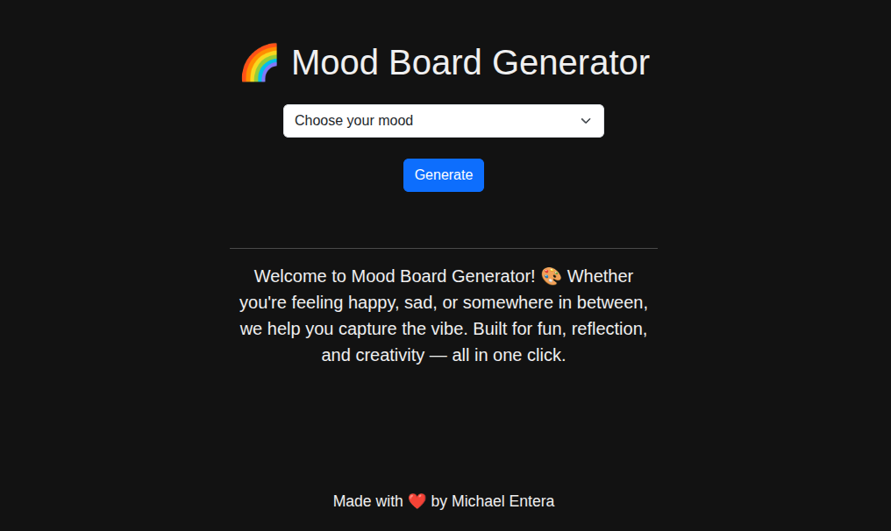

# 🌈 Mood Board Generator

Welcome to **Mood Board Generator**, a simple web app that helps you capture your current mood with a matching emoji, quote, and vibe. Built with Bootstrap 5 and JavaScript, this project is perfect for creative expression and reflection.

🔗 **Live Demo**: [https://moodboard-generator-dun.vercel.app](https://moodboard-generator-dun.vercel.app)

---

## ✨ Features

- Select your current mood from a dropdown
- Get a random quote, emoji, and mood label
- Clean and responsive UI with Bootstrap
- Subtle animations and visual feedback

---

## 🚀 Technologies Used

- HTML5
- CSS3
- Bootstrap 5.3
- JavaScript (Vanilla)

---

## 📸 Preview

---

## 👨‍💻 Author

Made with ❤️ by **Michael Entera**

---

## 📝 License

This project is open source and available under the [MIT License](LICENSE).
